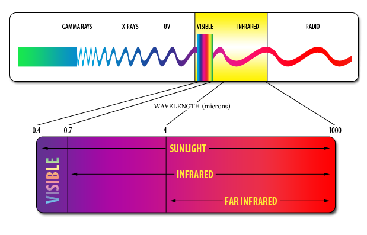
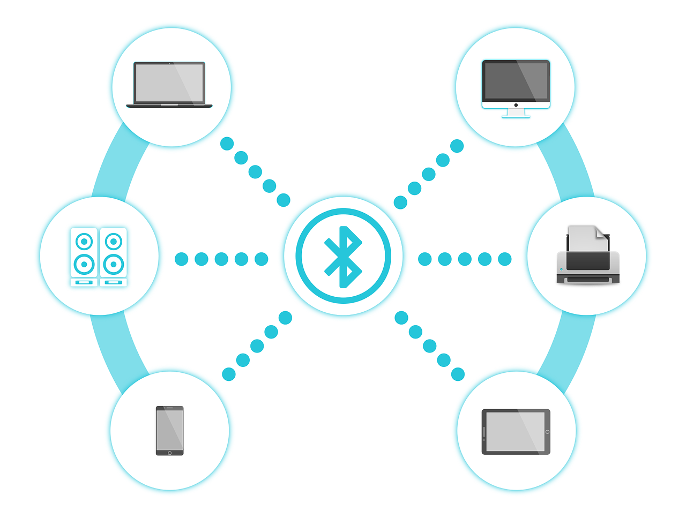
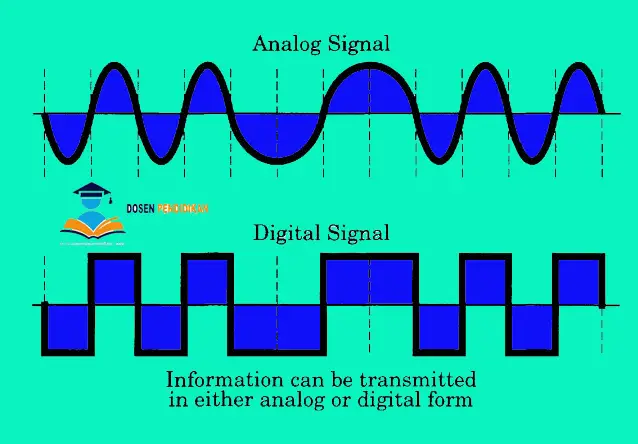

# 1. Sinyal RF, infared, bluetooth, wifi (jenis signal, ketinggian, contoh)

## 1. Sinyal RF ( Radio Frequency )

  Radio Frequency (RF) adalah gelombang radiasi elektromagnetik yang berpropagasi (memancar dengan arah tertentu) di udara (space) pada alokasi frekuensi yang berkisar antara 30 Hz sampai 300 GHz. Sinyal RF terutama banyak digunakan dalam teknologi Komunikasi dan transmisi data. Alokasi penggunaan range frekuensi untuk transmisi sinyal RF berbeda-beda untuk tiap aplikasi teknologi komunikasi,misalnya saja untuk transmisi radio digunakan range frekuensi 30-300 MHz, untuk transmisi stasiun televisi digunakan Ultra High Frequency (UHF) dengan range frekuensi 0,3-3 GHz, untuk komunikasi selular GSM ( Global System for Mobile ) digunakan frekuensi 900 MHz dan 1800 MHz, dan frekuensi 2,4 GHz untuk transmisi wireless LAN(Local Area Network )
   
   Sensor RF mempunyai 2 perangkat elektronik untuk mengirimkan sinyal gelombang elektromagnetik yang terdapat pada perangkat transmitter dan kemudian untuk menerima sinyal gelombang elektromagnetik tersebut yang terdapat pada perangkat receiver. Sensor RF sering digunakan pada pengendali jarak jauh tanpa kabel (remote control) dengan menggunakan Amplitude Shift Keying (ASK). Frekuensi yang digunakan pada proses pengiriman dan penerimaan harus sama agar tidak adanya kegagalan komunikasi yaitu sebesar 315 MHz. 
   
   Radio Frequensi (RF) mempunyai frekuensi sinyal yaitu dari 300 MHz sampai dengan 3 GHz (3.000 MHz) dan ketika ada halangan yang menghalangi sinyal RF, maka sinyal tersebut tidak akan terganggu, dan juga RF tidak akan interface oleh sinyal RF lainnya.

contoh, RF( Radio Frequency ) paling sering digunakan dalam produk volume sedang dan rendah untuk aplikasi konsumen seperti pembuka pintu garasi, sistem alarm atau pemantauan nirkabel, remote control industri , aplikasi sensor pintar, dan sistem otomasi rumah nirkabel .

## Jenis Modul RF ( Radio Frequency )
- modul pemancar
  Modul pemancar RF adalah sub-unit PCB kecil yang mampu mentransmisikan gelombang radio dan memodulasi gelombang tersebut untuk membawa data.
- modul penerima
  Modul penerima RF menerima sinyal RF termodulasi, dan mendemodulasinya .
- modul transceiver
  Modul transceiver RF menggabungkan pemancar dan penerima. 
- Modul Sistem pada sebuah chip (SoC)
  Modul SoC sama dengan modul transceiver, tetapi sering kali dibuat dengan mikrokontroler onboard. Mikrokontroler biasanya digunakan untuk menangani paket data radio atau     mengelola protokol seperti modul yang sesuai dengan IEEE 802.15.4 .

### Kelebihan Sinyal RF (Radio Frequency)
1. Menjangkau jarak yang relatif jauh. Garis pandangnya dapat mencapai 20 mil.
2. Dapat dioperasikan dalam kondisi kabur dan berkabut, kecuali hujan deras yang dapat menyebabkan kinerjanya menjadi lemah.
3. Operasi bebas lisensi (hanya untuk sistem berbasi 802.11).

### Kekurangan Sinyal RF (Radio Frequency)
1. Dengan jangkauan Mbps, throughput-nya lebih rendah
2. Sinyal RF mudah terganggu oleh sistem berbasis RF eksternal lain.
3. Perambatan radio melalui sebuah fasilitas lebih rentan.

# 2. infared (Inframerah)

Inframerah adalah radiasi elektromagnetik dari panjang gelombang lebih panjang dari cahaya tampak, tetapi lebih pendek dari radiasi gelombang radio. Radiasi inframerah memiliki jangkauan tiga "order" dan memiliki panjang gelombang antara 700  nm dan 1 mm, Inframerah ditemukan secara tidak sengaja oleh Sir William Herschell, astronom kerajaan Inggris ketika ia sedang mengadakan penelitian mencari bahan penyaring optis yang akan digunakan untuk mengurangi kecerahan gambar matahari pada teleskop tata surya.

## Jenis-jenis inframerah berdasarkan panjang gelombang
- Inframerah jarak dekat dengan panjang gelombang 0.75 – 1.5 µm.
- Inframerah jarak menengah dengan panjang gelombang 1.50 – 10 µm.
- Inframerah jarak jauh dengan panjang gelombang 10 – 100 µm.
Sinar infrared ada pada cahaya api,cahaya matahari, radiator kendaraan atau pantulan jalan aspal yang terpapar panas.

## Prinsip Kerja Infrared
memanfaatkan detektor infra red masing-masing benda yang dipancarkan infra red bakal memantulkan dan atau menyerap infra red sampai-sampai detektor menciduk panjang gelombang yang bertolak belakang sesuai suhu yang dikeluarkan benda,infrared memakai sinar guna memancarkan sinyal ,seperti tv remote ,infrared tidak bisa tembus benda yang menghalanginya untuk mencapai receiver atau perlu pantulan ,karena sifatnya cahaya .

## Kegunaan Inframerah dalam kehidupan
1. Kesehatan
2. Bidang komunikasi
3. Bidang keruangan
4. Bidang industri

## Kelebihan inframerah dalam pengiriman data
1. Pengiriman data dengan infra merah dapat dilakukan kapan saja, karena pengiriman dengan inframerah tidak membutuhkan sinyal.
2. Pengiriman data dengan infra merah dapat dikatakan mudah karena termasuk alat yang sederhana.
3. Pengiriman data dari ponsel tidak memakan biaya (gratis)

## Kelemahan inframerah dalam pengiriman data
1. Pada pengiriman data dengan inframerah, kedua lubang inframerah harus berhadapan satu sama lain. Hal ini agak menyulitkan kita dalam mentransfer data karena caranya yang merepotkan.
2. Inframerah sangat berbahaya bagi mata, sehingga jangan sekalipun sorotan inframerah mengenai mata
3. Pengiriman data dengan inframerah dapat dikatakan lebih lambat dibandingkan dengan rekannya Bluetooth.

# 3. Bluetooth

  Bluetooth adalah teknologi yang memungkinkan dua perlengkapan yang kompatibel, seperti telepon dan PC guna berkomunikasi tanpa kabel dan tidak membutuhkan koneksi drainase yang terlihat, Bluetooth beroperasi dalam pita frekuensi 2,4 GHz (antara 2.402 GHz hingga 2.480 GHz) yang dapat menyediakan layanan komunikasi data dan suara secara real-time antara host to host bluetooth dengan jarak cakupan layanan yang terbatas.Bluetooth bisa berupa card yang format dan kegunaannya hampir sama dengan card yang dipakai untuk wireless local lokasi network (WLAN) dimana memakai frekuensi radio standar IEEE 802.11, hanya saja pada bluetooth mempunyai cakupan jarak layanan yang lebih pendek dan keterampilan transfer data yang lebih rendah.
  
  bluetooth diciptakan tidak saja menggantikan atau menghilangkan pemakaian kabel didalam mengerjakan pertukaran informasi, tetapi pun mampu menawarkan fitur yang baik guna teknologi mobile wireless dengan ongkos yang relatif rendah, konsumsi daya yang rendah, interoperability yang menjanjikan, gampang dalam pengoperasian dan dapat menyediakan layanan yang bermacam-macam.

## Prinsip Kerja Bluetooth
Bluetooth sebenarnya muncul ditujukan guna mengatasi sejumlah kendala komunikasi data antar peranti elektronik yang lebih dahulu hadir, Bluetooth bekerja memakai frekuensi radio. Beda dengan inframerah yang mendasarkan diri pada gelombang cahaya. Jaringan Bluetooth bekerja pada frekuensi 2.402 Giga Hertz hingga dengan 2.480 Giga Hertz. Dibangkitkan dengan daya listrik kecil sehingga memberi batas daya jangkaunya melulu sampai 10 meter.

Penetapan frekuensi ini sudah distandardisasi secara internasional untuk perlengkapan elektronik yang digunakan untuk kepentingan industri, ilmiah, dan medis. Kecepatan transfer data Bluetooth rilis 1.0 ialah 1 mega bit per detik (Mbps), sementara versi 2.0 dapat menangani pertukaran data sampai 3 Mbps.
- bluetooth memakai frekuensi radio (RF) (2,4 GHz) guna membroadcast sinyal, bluetooth dapat menjebol benda seperti dinding sejauh tidak mempunyai skin depth yang tinggi.

# 4. Wi-Fi

  Wi-Fi adalah sebuah teknologi yang memanfaatkan peralatan elektronik untuk bertukar data secara nirkabel (menggunakan gelombang radio) melalui sebuah jaringan komputer, termasuk koneksi Internet berkecepatan tinggi, WiFi juga merupakan Jaringan Area Lokal atau LAN (Local Area Network) yang tidak memerlukan kabel dengan koneksi kecepatan yang tinggi. WiFi sering disebut juga dengan WLAN atau Wireless Local Area Network, Sinyal Radio adalah kunci yang memungkinan komunikasi dalam jaringan WiFi. 
  Teknologi WiFi ini menggunakan dua frekuensi gelombang radio dalam mengirimkan dan menerima sinyal Radio. Kedua Frekuensi gelombang radio tersebut adalah Frekuensi 2,4GHz dan 5GHz.

alat yang dapat memakai Wi-Fi (seperti komputer pribadi, konsol permainan video, telepon pintar, tablet, atau pemutar audio digital) dapat terhubung dengan sumber jaringan seperti Internet melalui sebuah titik akses jaringan nirkabel. Titik akses (atau hotspot) seperti itu mempunyai jangkauan sekitar 20 meter (65 kaki) di dalam ruangan dan lebih luas lagi di luar ruangan. 

## Jenis jaringan Wifi
  ### Jaringan WiFi 802.11
  Ada dua jenis jaringan WLAN yang dapat dibentuk dengan menggunakan sistem WiFi. Kedua jaringan tersebut adalah jaringan infrastruktur dan jaringan ad-hoc.
  
  1. Jaringan Infrastruktur (Infrastructure Network)
  Aplikasi jaringan infrastruktur ini ditujukan untuk perkantoran atau untuk menyediakan “hotspot”. Peralatan WLAN diinstalasi sebagai pengganti sistem kabel sehingga dapat memberikan penghematan biaya yang cukup besar. Jaringan kabel backbone masih tetap diperlukan dan terhubung ke server, masing-masing dilayani oleh Stasiun Pangkalan (Base Station) atau Access Point (AP) yang bertindak sebagai pengendali untuk sel yang bersangkutan. Setiap Access Point dapat memiliki jangkauan antara 30 dan 300 meter tergantung pada lingkungan dan lokasi Access Point.

  2. Jaringan Ad-Hoc
  Jaringan ini terbentuk ketika sejumlah komputer dan periferal (contohnya printer dan scanner) pada suatu lokasi ingin dihubungkan bersama antara satu dengan yang lainnya. Hubungan sejumlah komputer atau perangkat periferal ini mungkin diperlukan ketika beberapa orang sedang berkumpul dan memerlukan aktivitas berbagi data,  atau juga perlu mengakses printer tanpa harus menggunakan koneksi kabel, Jaringan Ad-Hoc ini tidak perlu menggunakan Titik Akses (Access Point) dan algoritma khusus dalam protokol.
   
   ### Standar Jaringan WiFi 802.11
   1. Standarisasi 802.11a
    Standarisasi 802.11a dapat mentransmisikan sinyal pada frekuensi 5GHz dengan kecepatan koneksi hingga 54 Mbps (Megabit data per detik). 802.11a ini menggunakan Orthogonal Frequency-Division Multiplexing (OFDM) yaitu teknik pengkodean yang lebih efisien yang membagi sinyal radio menjadi beberapa sub-sinyal sebelum mencapai penerima sehingga dapat mengurangi gangguna atau interference dalam koneksi.
    
   2. Standarisasi 802.11b
    802.11b adalah standard WiFi yang koneksinya paling lambat dengan harga yang paling murah. Standarisasi 802.11b pernah menjadi sangat popular karena harganya yang murah, tetapi sekarang menjadi kurang umum karena standarisasi WiFi dengan koneksi yang lebih cepat menjadi semakin murah. 802.11b yang mentransmisikan sinyal dalam pita frekuensi 2,4 GHz spektrum radio ini dapat menangani kecepatan hingga 11 Mbps (megabit data per detik) dan menggunakan modulasi Kode Kunci Pelengkap atau Complementary Code Keying (CCK) untuk meningkatkan kecepatannya.
    
   3. Standarisasi 802.11g
   802.11g menggunakan pita frekuensi 2,4 GHz Spektrum Radio seperti pada standarisasi 802.11b, tetapi kecepatan 802.11g jauh lebih cepat dibandingkan dengan standarisasi 802.11b.  Standarisasi WiFi 802.11g dapat menangani kecepatan koneksi hingga 54 megabit data per detik. Standarisasi WiFi ini dapat lebih cepat karena menggunakan pengkodean OFDM yang sama dengan 802.11a.
   
   4. Standarisasi 802.11n
    Standarisasi WiFi 802.11n adalah standar yang paling umum digunakan saat ini dan kompatibel dengan standarisasi lainnya seperti standarisasi 802.11a, b dan g, Standarisasi 802.11n dilaporkan dapat mencapai kecepatan setinggi 600 megabit per detik, WiFi 802.11n menggunakan pita frekuensi 2,4GHz dan 5GHz.
    
   5. Standarisasi 802.11ac
     Standarisasi WiFi 802.11ac ini kompatibel dengan 802.11n. Dengan kata lain, WiFi 802.11ac ini juga kompatibel dengan standarisasi WiFi lainnya juga. Standarisasi WiFi 802.11ac menggunakan pita frekuensi 5 GHz dengan kecepatan hingga 1,3 Gigabit per detik pada satu aliran jalur, namun pada kenyataannya mungkin lebih rendah.   
   
# 2. Encoding  

  Pengkodean adalah teknik yang dilakukan untuk memberikan penekanan pada proses yang terlibat (data dan sinyal) transmisi data, Pengkodean karakter atau pengkodean karakter disebut, terdiri dari kode yang pasang urutan karakter dari kumpulan dengan sesuatu yang lain. Sebagai urutan bilangan natural, oktet atau pulsa elektrik. jadi encoding adalah gambaran satu set password ke set sandi lain.

## Macam-Macam Kode
- Kode Baudot
  Berawal dari kode morse. Ada kode 4-an, 5-an, 6-an, dan 8-an yang digunakan untuk pengiriman telegraph yang disimpan di pita berupa lubang tutup. Untuk lubang sebanyak 6x      berturut-turut disebut sebagai kode 6-an.
- Standard Code (Americank figure. for Information Interchange).
  Didefinisikan sebagai kode 7 bit (sehingga dapat dibuat 128 karakter). Masing-masing yaitu 0-32 untuk karakter kontrol (unprintable) dan 32-127 untuk karakter yang tercetak (printable). Dalam transmisi synkron tiga karakter terdiri dari 10 atau 11 bit : 1 bit awal, 7 bit data, 1 atau 2 bit akhir dan 1 bit paritas.
- Kode 4 atau Kode 8.
  Kombinasi yang diijinkan adalah 4 bit “1” dan 4 bit “0” sehingga dapat dibuat kombinasi 70 karakter.
- Kode BCD (binary code desimal).
  Terdiri dari 6 bit perkarakter dengan kombinasi 64 karakter. Untuk asynkron terdiri dari 9 bit: 1 bit awal, 6 bit data, 1 bit paritas dan 1 bit akhir.
- Kode EBCID.
Menggunakan 8 bit perkarakter dengan 256 kombinasi karakter.

## Ketentuan Dalam Proses Encoding
1. Unipolar : Semua elemen-elemen sinyal dalam bentuk yang sama
2. Polar : Satu state logic dinyatakan oleh tegangan positif dan sebaliknya oleh tegangan negatif.
3. Rating Data : Rating data transmisi data dalam bit per secon
4. Durasi atau panjang suatu bit Waktu yang dibutuhkan pemancar untuk memancarkan bit.
5. Rating modulasi : Rating dimana level sinyal berubah dan diukur dalam bentuk baud=elemen-elemen sinyal per detik
6. Tanda dan ruang : Biner 1 dan biner 0 berturut-turut

## Teknik Encoding:
- Digital Data, Analog Signal (ASK, FSK, PSK, QAM)
- Analog Data, Analog Signal (AM, FM, PM)
- Analog Data, Digital Signal (PCM, DM)
- Digital Data, Digital Signal (NRZ, Manchester, Bi-Polar, Bi-Phase)

### Faktor yang mempengaruhi keberhasilan sinyal yang masuk:
- SNR 🡪 SNR semakin tinggi, error rate semakin rendah
- Data rate 🡪 data rate semakin tinggi, error rate semakin tinggi
- Bandwidth 🡪 bandwidth semakin tinggi, data rate semakin tinggi
- Skema encoding

### Sinyal Analog
  Sinyal analog adalah sinyal data dalam bentuk gelombang kontinyu, yang membawa informasi dengan mengubah karakteristik gelombang. Dua parameter-karakteristik penting yang dimiliki oleh sinyal analog amplitudo dan frekuensi, Sinyal analog biasanya diwakili oleh gelombang sinus, mengingat gelombang sinus merupakan dasar untuk semua bentuk sinyal analog, Gelombang pada sinyal analog yang umumnya berbentuk gelombang sinus memiliki tiga variabledasar, yaitu amplitudo, frekuensi dan fase.

1. Amplitudo adalah ukuran dari tegangan tinggi dan rendah dari sinyal analog.
2. Frekuensi adalah jumlah gelombang sinyal analog dalam hitungan detik.
3. Tahap adalah sudut besar sinyal analog pada saat tertentu.

### Digital Signal
Sinyal digital adalah sinyal data dalam bentuk pulsa yang dapat mengalami perubahan mendadak dan memiliki magnitudo 0 dan 1, Biasanya, sinyal ini juga dikenal sebagai sinyal diskrit. Sinyal memiliki dua Situasi ini sering disebut sebagai bit. Bit adalah istilah khas pada sinyal digital.

### NRZ (Non Return To Zero) Signaling
NRZ adalah teknik differential encoding Dalam NRZ, nilai-sinyal tinggi ‘1’ dalam bit biner, dan nilai-sinyal rendah ‘0’. NRZ dapat dibagi menjadi beberapa bagian, antara lain :
1. NRZ-L (Non Return Zero-Level)
2. NRZ-I (Non Return to Zero-Invert on ones)
3. NRZ-M (Non Return to Zero-Mark)
4. NRZ-S (Non Return to Zero-Space)

### Manchester Encoding
Manchester teknik encoding adalah salah satu teknik coding biphase, di mana ada transisi pada tiap babak periode bit, Manchester encoding memiliki beberapa keunggulan, seperti sinkronisasi yang baik karena transisi di setiap setengah dari bit dan penerima dapat mengatur transisi, hal itu disebut kode self-clocking, Manchester encoding juga tidak lagi mengandung komponen DC.

### 4B / 5B KODE GROUP
4B / 5B Kode Group adalah teknik coding yang memetakan blok bit informasi didefinisikan dalam sejumlah variabel m dan n. Jumlah bit dalam variabel n selalu lebih besar dari jumlah bit dalam variabel m, nilai n adalah jumlah bit dalam variabel m ditambah 1.
